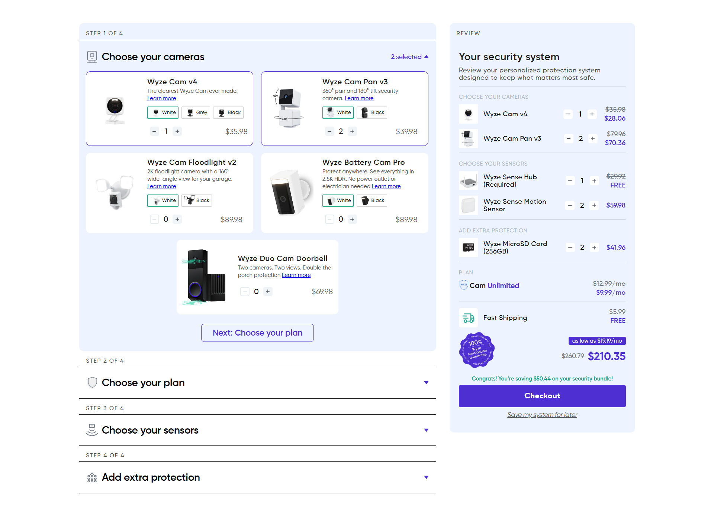

# Bundle Builder

## 📷 Screenshots & Demo



---

## 🛠️ Tech Stack

- React
- Tailwind CSS

---

## Environment variables

Create a `.env` file in the project root (or set these variables in your deployment environment).

```bash
VITE_REACT_APP_BASE_URL="http://localhost:8000/"
```

---

## Project setup

1- Clone the repository:

```bash
git clone <repository_url>
```

2- Navigate to the project directory:

```bash
cd <project_directory>
```

3- Install dependencies:

```bash
npm install
```

4- Start the development server:

```bash
npm run dev
```
